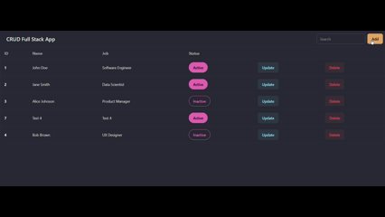

# CRUD Full Stack PERN App  

[](https://crud-app-rt.netlify.app/)  
  
  

## 🚀 Live Demo  
👉 [CRUD App Live Deployment](https://crud-app-rt.netlify.app/)  



## 📌 About the Project  
This is a **Full Stack CRUD Application** built using the **PERN stack**:  
- **PostgreSQL** – database  
- **Express.js** – backend REST API  
- **React (Vite)** – frontend  
- **Node.js** – runtime  

It allows users to **create, read, update, and delete members** with details such as **Name, Job, and Status**.  

This project was developed to **learn full stack development end-to-end**: designing API, connecting frontend with backend, handling database queries, and deploying to cloud platforms.  

## 🛠️ Tech Stack  

**Frontend:**  
  
  
  

**Backend:**  
  
  
  

**Deployment:**  
  
  

## 📂 Project Structure  

```
CRUD-Full-Stack-PERN-App/
│
├── backend/                 # Backend code (Express + PostgreSQL)
│   ├── controllers/         # Controller logic
│   ├── models/              # Database queries
│   ├── routes/              # API routes
│   ├── utils/               # Helper functions
│   ├── test/                # Test files
│   ├── server.js            # Entry point for backend
│   ├── package.json
│   └── .env                 # Environment variables
│
├── frontend/                # Frontend code (React + Vite)
│   ├── public/              # Static assets
│   ├── src/                 # React components
│   ├── index.html
│   ├── package.json
│   └── vite.config.js
│
├── LICENSE
└── README.md
```

## 📸 Snapshot


 - 🏠 Homepage

 - ➕ Add Member Modal

 - ✏️ Update Member Modal

## ✨ Features

  * ✅ Add new members with **Name, Job, Status**
  * ✅ Update existing member details
  * ✅ Delete members
  * ✅ Responsive UI with TailwindCSS
  * ✅ Connected with PostgreSQL database
  * ✅ Full stack deployment with Netlify (frontend) + Render (backend)


## ⚙️ Installation & Setup

### 🔹 Prerequisites

  * [Node.js](https://nodejs.org/) (\>= 16.x)
  * [PostgreSQL](https://www.postgresql.org/)


### 🔹 Clone the repository

```bash
git clone https://github.com/ryantusi/CRUD-Full-Stack-PERN-App.git
cd CRUD-Full-Stack-PERN-App
```

### 🔹 Backend Setup

```bash
cd backend
npm install
```

Create a `.env` file in `/backend` and add:

```bash
DATABASE_URL=your_postgres_connection_string
NODE_ENV=development
PORT=5000
```

Start the backend server:

```bash
npm start
```

By default, runs on `http://localhost:8000`

### 🔹 Frontend Setup

```bash
cd frontend
npm install
```

Create a `.env` file in `/frontend` and add:

```bash
VITE_API_URL=http://localhost:8000
```

Run the frontend dev server:

```bash
npm run dev
```

By default, runs on `http://localhost:5173`


## 🚀 Deployment

### 🔹 Backend (Render)

1.  Push code to GitHub
2.  Create a new Web Service on Render
3.  Connect repo → Select `backend/` as root → `npm start` as start command
4.  Add `DATABASE_URL` in environment variables
5.  Deploy\!

### 🔹 Frontend (Netlify)

1.  Go to Netlify → New Site
2.  Connect repo → Base directory: `frontend`
3.  Build command: `npm run build`
4.  Publish directory: `frontend/dist`
5.  Add `VITE_API_URL` pointing to your Render backend URL in Netlify environment variables
6.  Deploy\!

-----

## 📖 API Endpoints

| Method | Endpoint | Description |
| :--- | :--- | :--- |
| `GET` | `/` | Get all members |
| `POST` | `/create` | Add a new member |
| `PUT` | `/update/:id` | Update member by ID |
| `DELETE` | `/remove/:id` | Delete member by ID |


## 📝 License

This project is licensed under the Creative Commons License.

## 🤝 Contributing

Pull requests are welcome\! For major changes, please open an issue first to discuss what you would like to change.

-----

## ⭐ Show Your Support

If you like this project, please ⭐ the repo\!
